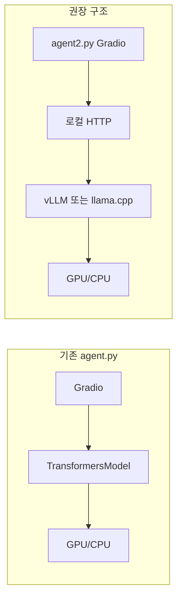
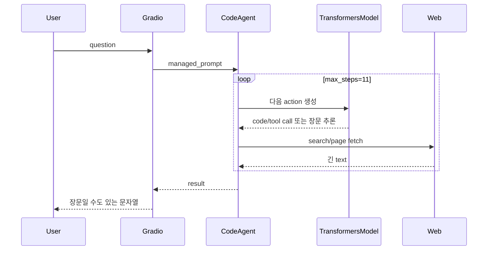
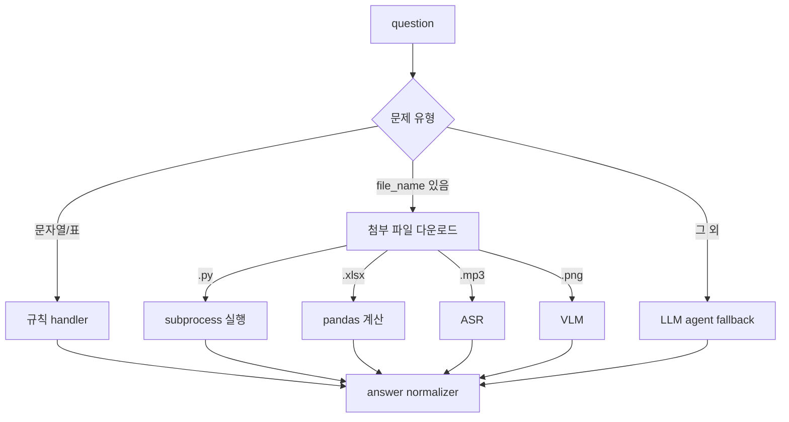
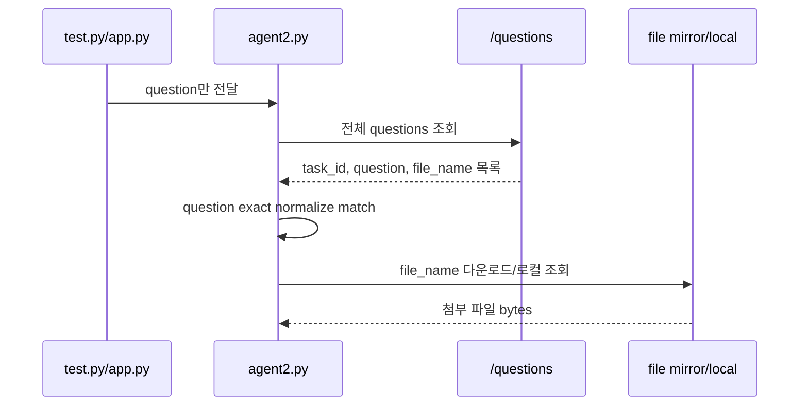
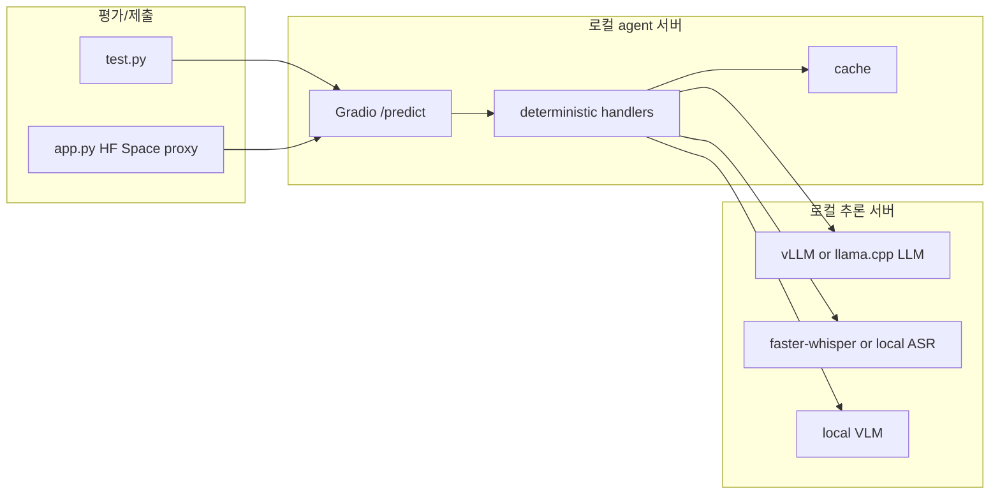
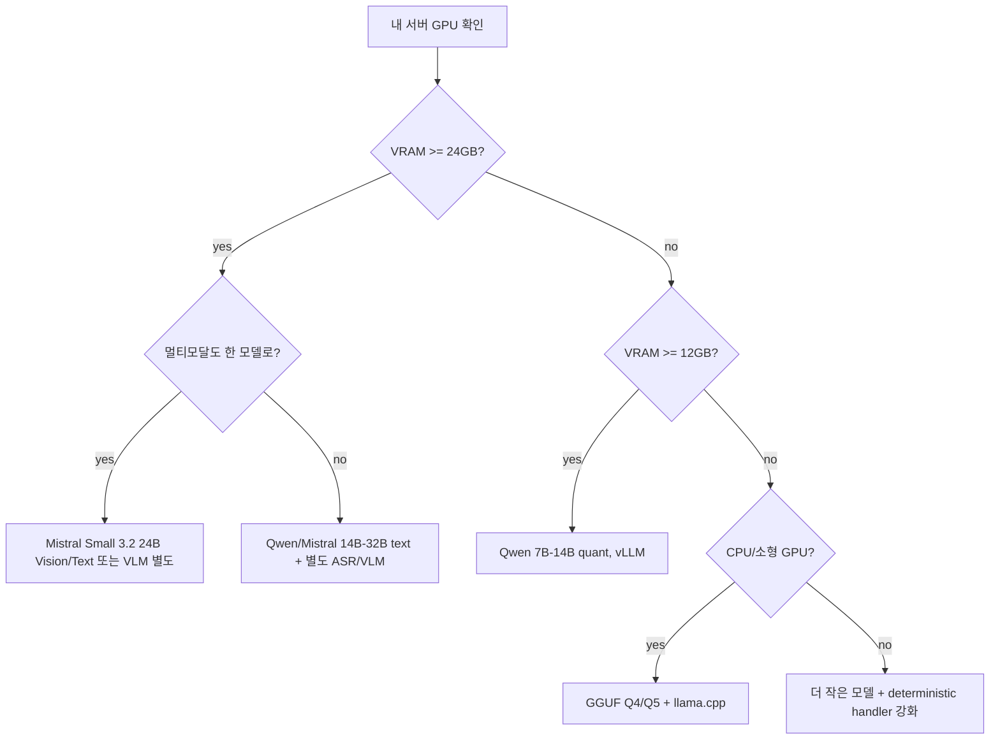
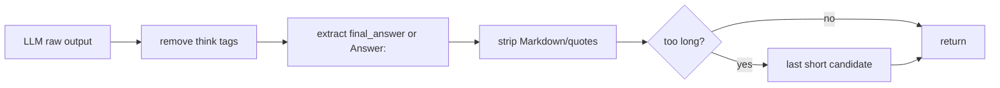
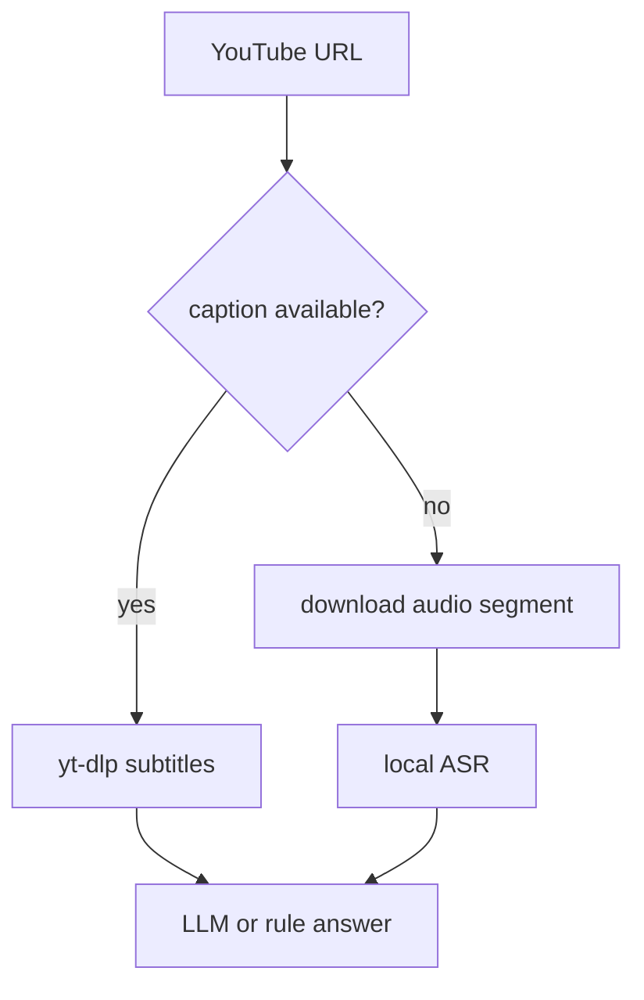

# Local GAIA Agent 성능/정답률 개선 보고서

> 대상 코드: `agent.py`, `agent2.py`  
> 대상 과제: Hugging Face Agents Course Unit 4 final assignment 스타일의 GAIA Level 1 20문항  
> 기본 전제: **외부 유료 LLM API를 쓰지 않는다.** 여기서 `OpenAI-compatible`은 vLLM, llama.cpp, LocalAI 같은 **내 서버의 로컬 HTTP API 형식**을 뜻한다.

---

## 1. 결론 요약

기존 `agent.py`의 성능 문제는 “모델이 작아서”만이 아니다. 더 큰 원인은 **모든 문제를 같은 방식으로 LLM 에이전트에게 던지는 구조**다.

GAIA 스타일 문제는 한 종류가 아니다.

- 웹에서 사실을 찾아야 하는 문제
- 첨부 Python 파일을 실행해야 하는 문제
- Excel을 읽어 합계를 계산해야 하는 문제
- 오디오를 전사해야 하는 문제
- 이미지를 이해해야 하는 문제
- 표나 문자열을 deterministic하게 계산하면 되는 문제
- 마지막 제출 형식이 exact-match에 가까운 문제

이 문제들을 모두 `CodeAgent + web_search + visit_webpage`로 풀면 느리고 불안정하다. 특히 exact-match 채점에서는 긴 설명문이 정답이어도 오답이 된다.

따라서 개선 방향은 다음 한 문장으로 요약된다.

> LLM을 “모든 것을 처리하는 실행 주체”가 아니라, deterministic handler가 처리하지 못한 문제를 해결하는 **마지막 추론 엔진**으로 낮춘다.

`agent2.py`는 이 원칙을 반영해 다음 구조로 바뀌었다.

```mermaid
flowchart TD
    Q[question 입력] --> N[질문 정규화]
    N --> M[/questions에서 task_id/file_name 복구]
    M --> C{정답 캐시 hit?}
    C -->|yes| R[짧은 최종답 반환]
    C -->|no| D{deterministic handler 가능?}
    D -->|Python| PY[첨부 .py timeout 실행]
    D -->|Excel| XL[pandas/openpyxl 계산]
    D -->|표/문자열| RULE[규칙 기반 계산]
    D -->|Audio| ASR[faster-whisper 또는 로컬 ASR 서버]
    D -->|Vision| VLM[로컬 VLM 서버]
    D -->|no| A[CodeAgent fallback]
    PY --> F[final answer 정규화]
    XL --> F
    RULE --> F
    ASR --> F
    VLM --> F
    A --> F
    F --> S[캐시 저장]
    S --> R
```

---

## 2. 현재 실패의 정량적 증거

기존 실행 결과 `gaia_agent_local_test_results.csv` 기준:

| 지표 | 값 | 의미 |
|---|---:|---|
| 총 문항 수 | 20 | HF Unit 4 final assignment 형식 |
| 평균 제출 답변 길이 | 2354.2자 | exact-match 과제에 매우 부적합 |
| 중앙값 | 11자 | 일부는 짧은 답을 냈지만 실패 케이스가 극단적으로 김 |
| 최대 답변 길이 | 18636자 | Excel 문제에서 파일을 못 읽고 장문 변명/탐색을 제출 |
| 400자 초과 답변 | 7개 | 대체로 오답 또는 형식 오답 가능성이 높음 |
| 40자 이하 답변 | 12개 | 사용자가 말한 약 60% 정답률과 잘 맞음 |

문제 유형별 실패 양상:

| Task 유형 | 기존 증상 | 근본 원인 | agent2 개선 |
|---|---|---|---|
| 첨부 `.py` | “파일이 없다”는 장문 답변 | `test.py`가 `file_name`을 버림 | 질문 매칭으로 파일명 복구 후 subprocess 실행 |
| 첨부 `.xlsx` | 18k자 이상 장문 탐색 | Excel parser 없음 | `pandas.read_excel()`로 직접 합산 |
| 첨부 이미지 | 이미지 없음으로 추측 | 이미지 파일 접근 경로 없음 | 로컬 VLM endpoint가 있으면 직접 질의 |
| 오디오 | 파일 없음/전사 불가 | ASR 도구 없음 | `faster-whisper` 또는 로컬 ASR endpoint |
| 웹 사실 검색 | 장문 reasoning 제출 | final answer contract 약함 | 최종답 정규화 + 검색/페이지 캐시 |
| 단순 규칙/표 | LLM 낭비 | deterministic 문제를 agent loop로 처리 | Python handler로 즉시 계산 |

---

## 3. 초심자를 위한 핵심 개념

### 3.1 LLM inference는 두 단계로 느려진다

LLM 응답 시간은 크게 두 단계다.

```text
총 시간 = prefill 시간 + decode 시간 + tool I/O 시간
```

- **prefill**: 입력 prompt 전체를 읽고 KV cache를 만드는 단계
- **decode**: 새 token을 한 개씩 생성하는 단계
- **tool I/O**: 검색, 페이지 다운로드, 파일 처리, Python 실행 같은 외부 작업

기존 `agent.py`는 다음 세 가지를 동시에 악화시켰다.

1. 페이지 전문을 Markdown으로 넣어 prefill이 커짐
2. `max_steps=11`, `planning_interval=3`로 LLM 호출 횟수가 늘어남
3. 최종답 대신 장문 설명을 생성해 decode가 길어짐

### 3.2 왜 vLLM/llama.cpp 서버가 유리한가

`TransformersModel`을 Gradio 프로세스 안에서 직접 쓰면 “질문 처리 서버”와 “모델 추론 엔진”이 한 몸이 된다. 이 구조는 단순하지만 운영 관점에서는 손해가 크다.



서버 분리의 장점:

- 모델을 한 번만 띄워두고 재사용한다.
- vLLM은 OpenAI-compatible server, structured outputs, tool calling, quantization, prefix caching을 제공한다. 공식 문서 기준으로 tool auto choice에는 `--enable-auto-tool-choice`와 `--tool-call-parser`가 핵심 플래그다.  
  참고: [vLLM Tool Calling](https://docs.vllm.ai/en/latest/features/tool_calling/)
- vLLM structured outputs는 JSON schema/regex/choice/grammar 기반 constrained decoding을 지원한다. 최신 문서는 deprecated guided 옵션 대신 `structured_outputs` 사용을 안내한다.  
  참고: [vLLM Structured Outputs](https://docs.vllm.ai/en/latest/features/structured_outputs/)
- llama.cpp는 가볍고 GGUF 운영이 쉽다. 서버 README는 OpenAI-style function calling을 `--jinja`와 tool-use chat template로 지원한다고 설명한다.  
  참고: [llama.cpp server](https://github.com/ggml-org/llama.cpp/blob/master/tools/server/README.md)

---

## 4. 기존 `agent.py`의 구조적 한계

기존 코드는 개념적으로 다음 형태다.



문제는 `CodeAgent` 자체가 나쁘다는 것이 아니다. Hugging Face의 smolagents 문서는 `CodeAgent`가 Python code를 사용해 작업을 풀 수 있는 간단한 agent abstraction이라고 설명한다.  
참고: [smolagents documentation](https://huggingface.co/docs/smolagents/en/index)

문제는 **agent를 언제 쓰느냐**다.

다음처럼 처리해야 하는 문제도 LLM loop로 보내면 낭비다.

```python
# 비가환성 표 문제는 LLM이 아니라 비교 연산이면 충분하다.
if op[a][b] != op[b][a]:
    bad.update([a, b])
```

Excel 문제도 마찬가지다.

```python
# 음료 컬럼을 제외한 숫자 컬럼 합계
for column in frame.columns:
    if column.lower() in {"soda", "drink", "beverage"}:
        continue
    total += pd.to_numeric(frame[column], errors="coerce").sum()
```

즉, 기존 `agent.py`의 핵심 실수는 “LLM을 너무 많이 믿은 것”이다. 정확한 시스템은 LLM을 더 똑똑하게 만드는 것보다 **LLM이 필요 없는 일을 제거**하는 쪽에서 먼저 개선된다.

---

## 5. `agent2.py` 설계 원리

### 5.1 Router-first architecture

`agent2.py`는 질문을 받으면 먼저 문제를 분류한다.



이 구조가 빠른 이유:

- deterministic 문제는 모델 로드 없이 끝난다.
- 파일 문제는 “없는 파일을 상상”하지 않고 실제 파일을 처리한다.
- LLM fallback은 정말 필요한 문제에만 사용한다.
- 검색/페이지/정답 캐시가 반복 평가 시간을 줄인다.

### 5.2 질문만으로 `file_name` 복구

현재 `test.py`와 `app.py`는 `/questions`에서 받은 `file_name`을 agent에 넘기지 않는다. 그래서 `agent2.py`는 질문 텍스트를 scoring 서버 응답과 매칭한다.

```python
def _question_record(question: str) -> dict[str, Any] | None:
    normalized = _normalize_question(question)
    for item in _fetch_questions():
        if _normalize_question(str(item.get("question", ""))) == normalized:
            return item
    return None
```

초심자 관점에서 보면 이것은 “잃어버린 첨부파일 이름을 출석부에서 다시 찾는 과정”이다.



### 5.3 Final answer normalizer

LLM이 다음처럼 말하면 사람은 답을 알아볼 수 있지만 채점기는 틀릴 수 있다.

```text
Based on my research, the answer is 5.
```

채점기에는 대개 다음만 제출해야 한다.

```text
5
```

그래서 `agent2.py`는 다음 흔적을 제거한다.

- `<think>...</think>`
- `final_answer("...")`
- `Final answer: ...`
- Markdown bullet/header
- 지나치게 긴 reasoning block

이 레이어는 작지만 정답률에 큰 영향을 준다. 기존 CSV에서 장문 답변 7개가 있었고, 그중 일부는 실제 답을 포함했어도 형식 때문에 틀렸을 가능성이 높다.

---

## 6. 로컬 추론 서버 운영 설계

### 6.1 권장 프로세스 구성



각 서버는 분리한다.

| 컴포넌트 | 역할 | 죽었을 때 영향 | 권장 실행 방식 |
|---|---|---|---|
| `agent2.py` | 문제 라우팅, 파일 처리, 캐시, fallback agent | API 응답 불가 | tmux/systemd |
| vLLM/llama.cpp | 텍스트 추론 | 웹/지식 문제 fallback 실패 | 별도 tmux/systemd |
| ASR | 오디오 전사 | 오디오 문제 실패 | 필요할 때만 |
| VLM | 이미지/체스 문제 | 이미지 문제 실패 | 필요할 때만 |

### 6.2 vLLM 실행 예시

가장 먼저 테스트할 기본형:

```bash
vllm serve Qwen/Qwen3-8B \
  --host 0.0.0.0 \
  --port 8000 \
  --dtype auto \
  --gpu-memory-utilization 0.90 \
  --max-model-len 8192 \
  --enable-prefix-caching
```

`agent2.py` 연결:

```bash
export AGENT2_LLM_BASE_URL=http://127.0.0.1:8000/v1
export AGENT2_LLM_API_KEY=EMPTY
export AGENT2_MODEL_ID=Qwen/Qwen3-8B
python agent2.py
```

tool calling을 vLLM 서버 자체에서 쓰는 경우:

```bash
vllm serve Qwen/Qwen3-4B-Instruct-2507 \
  --host 0.0.0.0 \
  --port 8000 \
  --dtype auto \
  --max-model-len 8192 \
  --enable-prefix-caching \
  --enable-auto-tool-choice \
  --tool-call-parser hermes
```

주의:

- vLLM 문서상 auto tool choice에는 `--enable-auto-tool-choice`와 `--tool-call-parser`가 필요하다.
- Qwen3-Coder 계열은 `qwen3_xml`, GLM-4.5는 `glm45`, Mistral은 `mistral` 등 parser가 다르다.
- tool parser가 맞지 않으면 모델이 답은 알아도 tool JSON을 깨뜨린다.

### 6.3 structured output으로 최종답 강제

현재 `agent2.py`는 smolagents fallback 결과를 후처리한다. 더 강하게 만들려면 모델 호출 자체를 JSON schema로 제한한다.

예시:

```python
from openai import OpenAI

client = OpenAI(base_url="http://127.0.0.1:8000/v1", api_key="EMPTY")

schema = {
    "type": "object",
    "properties": {
        "answer": {"type": "string"}
    },
    "required": ["answer"],
    "additionalProperties": False,
}

response = client.chat.completions.create(
    model="Qwen/Qwen3-8B",
    temperature=0,
    messages=[
        {"role": "system", "content": "Return only the final answer in JSON."},
        {"role": "user", "content": question},
    ],
    extra_body={"structured_outputs": {"json": schema}},
)
```

vLLM 최신 문서는 `guided_json`, `guided_regex` 같은 legacy 필드 대신 `structured_outputs`를 사용하라고 안내한다.  
참고: [vLLM Structured Outputs](https://docs.vllm.ai/en/latest/features/structured_outputs/)

---

## 7. 모델 선택 전략

모델 선택은 “가장 큰 모델” 문제가 아니다. 이 과제에서는 다음 기준이 더 중요하다.

1. instruction following: “답만 내라”를 잘 지키는가
2. tool calling 안정성: tool schema를 깨뜨리지 않는가
3. 검색 결과 요약 능력: 웹 문서에서 핵심 사실만 뽑는가
4. 긴 컨텍스트 비용: 필요 이상으로 KV cache를 먹지 않는가
5. 로컬 서버 호환성: vLLM/llama.cpp에서 안정적으로 도는가

### 7.1 권장 후보군

| 환경 | 1차 후보 | 이유 | 주의 |
|---|---|---|---|
| 8-12GB VRAM | Qwen3 4B/8B instruct 계열 | 빠르고 agentic/tool 사용 문서가 많음 | 복잡한 웹 추론은 흔들릴 수 있음 |
| 16-24GB VRAM | Qwen3 14B 계열, Mistral Small 24B quant | 정확도/속도 균형 | context 길이와 quant 선택 필요 |
| 24GB+ | Mistral-Small-3.2-24B-Instruct-2506, DeepSeek-R1-Distill-Qwen-32B | 추론력 상승 | reasoning 모델은 장문 출력 억제가 필요 |
| 멀티 GPU | GLM-4.5-Air, Qwen MoE 계열 | tool/reasoning 능력 우수 | serve 설정과 parser 검증 필수 |
| CPU/소형 GPU | Unsloth Dynamic GGUF + llama.cpp | 배포 쉬움 | vLLM production 경로로는 GGUF보다 safetensors quant가 일반적으로 낫다 |

확인한 공식/1차 자료:

- Qwen3 4B Instruct 모델 카드는 Qwen-Agent가 tool-calling template/parser를 캡슐화한다고 설명한다.  
  참고: [Qwen/Qwen3-4B-Instruct-2507](https://huggingface.co/Qwen/Qwen3-4B-Instruct-2507)
- Mistral Small 3.2 24B 모델 카드는 vLLM API server와 function calling 예시를 제공한다.  
  참고: [Mistral-Small-3.2-24B-Instruct-2506](https://huggingface.co/mistralai/Mistral-Small-3.2-24B-Instruct-2506)
- GLM-4.5 모델 카드는 reasoning/tool usage와 non-thinking mode를 구분한다.  
  참고: [zai-org/GLM-4.5](https://huggingface.co/zai-org/GLM-4.5)
- DeepSeek-R1-Distill-Qwen-32B는 강한 reasoning 후보지만 `<think>` 출력/장문 경향을 final answer normalizer로 제어해야 한다.  
  참고: [DeepSeek-R1-Distill-Qwen-32B](https://huggingface.co/deepseek-ai/DeepSeek-R1-Distill-Qwen-32B)

### 7.2 모델 선택 의사결정 트리



---

## 8. 양자화 전략

양자화는 “무조건 4bit가 좋다”가 아니다. 정확도, 메모리, throughput, 서버 호환성을 같이 봐야 한다.

### 8.1 초심자용 직관

```text
BF16/FP16: 크고 정확함, VRAM 많이 씀
FP8: 정확도 손실을 낮게 유지하며 VRAM 절약, 최신 GPU에 좋음
AWQ/GPTQ INT4: VRAM 크게 절약, 모델/커널 궁합 중요
GGUF Q5/Q4: llama.cpp 운영에 편함, 작은 서버에 좋음
```

### 8.2 vLLM 기준

vLLM quantization 문서는 FP8, INT8, INT4, AWQ, GPTQModel, quantized KV cache 등 다양한 형식을 지원한다고 설명한다. 하드웨어 호환 표도 제공한다.  
참고: [vLLM Quantization](https://docs.vllm.ai/en/latest/features/quantization/)

| 선택 | 추천 상황 | 장점 | 리스크 |
|---|---|---|---|
| BF16/FP16 | VRAM 충분, 정확도 우선 | 가장 단순하고 안정적 | 메모리 큼 |
| FP8 W8A8 | Ada/Hopper급 GPU | 속도/메모리 균형 | GPU 지원 확인 필요 |
| AWQ/GPTQ | 16-24GB에서 큰 모델 | VRAM 절약 | 모델별 kernel 성능 편차 |
| INT8 | 정확도 손실 최소화와 메모리 절충 | 안정적 | 4bit보다 메모리 큼 |
| KV cache quant | 긴 context/동시 요청 | context 메모리 절약 | 품질/속도 회귀 측정 필요 |

### 8.3 GGUF/Unsloth Dynamic

GGUF는 llama.cpp 생태계에서 강하다. Unsloth 문서는 Dynamic 2.0 GGUF가 layer별 quantization type을 더 세밀하게 조정한다고 설명한다.  
참고: [Unsloth Dynamic 2.0 GGUFs](https://unsloth.ai/docs/basics/unsloth-dynamic-2.0-ggufs), [Saving to GGUF](https://unsloth.ai/docs/basics/inference-and-deployment/saving-to-gguf)

권장:

- llama.cpp/Ollama/Open WebUI 경로: GGUF Q5_K_M 또는 Dynamic Q4/Q5
- vLLM production 경로: 가능하면 safetensors 기반 BF16/FP8/AWQ/GPTQ
- 정확도 검증 없이 Q2/Q3로 내리지 말 것

---

## 9. Tool 설계: 정확도는 도구에서 나온다

GAIA Level 1도 순수 텍스트 QA가 아니다. 도구는 “있으면 좋은 것”이 아니라 정답률의 핵심이다.

| 도구 | 왜 필요한가 | 구현 수준 | 다음 개선 |
|---|---|---|---|
| Search | 최신/희귀 사실 탐색 | `ddgs` 캐시 검색 | source ranking, site-specific search |
| Visit webpage | 검색 결과 검증 | HTML 정리 + 길이 제한 | readability/trafilatura 적용 |
| Python runner | 첨부 코드 실행 | timeout subprocess | sandbox 강화, stdout/stderr 분리 |
| Excel parser | 표 계산 | pandas/openpyxl | 질문 기반 컬럼 선택 LLM 보조 |
| Audio ASR | mp3 문제 | faster-whisper/로컬 endpoint hook | whisper.cpp server 추가 |
| Vision/VLM | 이미지/체스 | 로컬 VLM endpoint hook | chessboard detector + engine |
| YouTube | 영상 문제 | 아직 수동/LLM fallback | yt-dlp 자막/프레임 추출 |

### 9.1 Code execution은 LLM보다 신뢰할 수 있다

첨부 Python 문제는 LLM에게 “코드를 읽고 답해봐”라고 하는 것보다 실행하는 편이 낫다.

```python
result = subprocess.run(
    [sys.executable, str(path.resolve())],
    cwd=str(path.parent),
    text=True,
    capture_output=True,
    timeout=int(os.getenv("AGENT2_CODE_TIMEOUT", "90")),
    check=False,
)
answer = (result.stdout or result.stderr).strip().splitlines()[-1]
```

중요한 점:

- `cwd`를 첨부 파일 폴더로 둔다.
- `timeout`을 둔다.
- 마지막 출력 줄만 답으로 쓴다.
- 임의 파일 실행이므로 실제 운영에서는 sandbox가 필요하다.

### 9.2 Excel은 언어모델 문제가 아니다

Excel 문제는 LLM이 표를 “읽는” 문제가 아니라 parser가 숫자를 정확히 읽는 문제다.

```python
sheets = pd.read_excel(path, sheet_name=None)
for frame in sheets.values():
    for column in frame.columns:
        if str(column).lower() in {"soda", "drink", "beverage"}:
            continue
        total += pd.to_numeric(frame[column], errors="coerce").sum()
```

이 방식은 hallucination이 없다. 단점은 질문이 복잡할수록 어떤 컬럼을 제외할지 rule을 더 세밀하게 만들어야 한다는 점이다.

---

## 10. Prompt와 output contract

LLM prompt는 길수록 좋은 것이 아니다. 이 과제에서는 다음 contract가 중요하다.

```text
1. 필요한 경우에만 tool을 사용한다.
2. 계산 가능한 것은 Python으로 계산한다.
3. final_answer에는 exact final answer string만 넣는다.
4. 설명, citation, Markdown을 제출하지 않는다.
```

권장 system prompt:

```text
You solve exact-answer benchmark tasks.
Use tools only when they reduce uncertainty.
Never submit reasoning.
When done, call final_answer with only the exact answer string.
Preserve requested casing, punctuation, ordering, and units.
```

하지만 prompt만으로는 부족하다. 그래서 코드 레벨 normalizer가 필요하다.



---

## 11. 성능 튜닝 플레이북

### 11.1 우선순위

1. 정답 형식부터 고친다.
2. 첨부 파일을 실제로 읽게 한다.
3. deterministic handler를 늘린다.
4. 모델 서버를 분리한다.
5. vLLM/llama.cpp 튜닝을 한다.
6. 모델 크기/양자화를 바꾼다.

모델 교체는 6번째다. 앞의 5개가 안 되면 큰 모델도 느리고 비싸고 불안정하다.

### 11.2 benchmark script

반복 측정을 위해 다음 스크립트를 추가하는 것을 권장한다.

```python
import time
import pandas as pd
from gradio_client import Client

client = Client("http://localhost:7860")
rows = []

for _, row in questions.iterrows():
    started = time.perf_counter()
    answer = client.predict(question=row["question"], api_name="/predict")
    elapsed = time.perf_counter() - started
    rows.append({
        "task_id": row["task_id"],
        "answer": answer,
        "chars": len(str(answer)),
        "seconds": round(elapsed, 2),
    })

pd.DataFrame(rows).to_csv("agent2_benchmark.csv", index=False)
```

측정해야 할 지표:

| 지표 | 목표 |
|---|---|
| 답변 평균 길이 | 40자 이하 |
| 400자 초과 답변 | 0개 |
| deterministic 문제 latency | 1초 이내, 첨부 Python 예외 |
| 웹 fallback latency | 30-90초 이내 |
| unknown/error | 0개에 가깝게 |
| 동일 문항 2회차 latency | 캐시 덕분에 크게 감소 |

### 11.3 vLLM 서버 상태 확인

```bash
curl http://127.0.0.1:8000/v1/models
```

간단한 chat 확인:

```bash
curl http://127.0.0.1:8000/v1/chat/completions \
  -H "Content-Type: application/json" \
  -d '{
    "model": "Qwen/Qwen3-8B",
    "messages": [{"role": "user", "content": "Return only: OK"}],
    "temperature": 0,
    "max_tokens": 8
  }'
```

### 11.4 prefix caching의 의미

agent workload는 system prompt, tool schema, instruction prefix가 반복된다. vLLM prefix cache는 같은 prefix의 KV block을 재사용해 prefill 비용을 줄인다. vLLM 문서는 prefix cache가 token block hash를 기반으로 동작하며, 멀티모달 입력에서는 이미지 hash 같은 extra hash도 고려한다고 설명한다.  
참고: [vLLM Automatic Prefix Caching](https://docs.vllm.ai/en/stable/design/prefix_caching/)

실무 팁:

- system prompt와 tool schema를 매 요청마다 최대한 동일하게 유지한다.
- 불필요한 timestamp, random nonce를 prompt 앞부분에 넣지 않는다.
- 긴 문서 전문을 system prompt 앞에 붙이지 않는다.

---

## 12. `agent2.py`에서 이미 좋아진 점과 아직 부족한 점

### 이미 좋아진 점

| 항목 | 기존 | agent2 |
|---|---|---|
| 모델 로드 | import 시 즉시 | LLM fallback 때 lazy load |
| 첨부 파일 | 사용 불가 | question 매칭으로 file_name 복구 |
| Python 첨부 | LLM 추측 | subprocess 실행 |
| Excel 첨부 | LLM 추측 | pandas 계산 |
| 검색/페이지 | 반복 실행 | 캐시 |
| 최종답 | 장문 가능 | normalizer |
| 로컬 서버 | 없음 | `AGENT2_LLM_BASE_URL` 지원 |

### 아직 부족한 점

| 부족한 점 | 영향 | 개선안 |
|---|---|---|
| Audio dependency 기본 미포함 | mp3 문제 fallback 약함 | `faster-whisper` 또는 whisper.cpp server 연결 |
| Vision 문제 전용 로직 없음 | 체스 이미지 문제 약함 | VLM + chess engine 조합 |
| YouTube 영상 처리 없음 | 영상 count/대사 문제 약함 | `yt-dlp` 자막/프레임 추출 |
| 웹 source ranking 단순 | 희귀 사실 검색에서 오답 가능 | Wikipedia/API/site-specific resolver |
| structured output 미적용 | fallback 장문 가능성 남음 | vLLM `structured_outputs` 직접 호출 layer |

---

## 13. 다음 단계 코드 개선안

### 13.1 LLM fallback을 JSON-only client로 분리

현재는 `CodeAgent`가 fallback을 담당한다. 더 안정적으로 하려면 `OpenAIServerModel` 대신 직접 local OpenAI-compatible client를 호출하는 얇은 함수를 추가한다.

```python
def ask_json_answer(question: str) -> str | None:
    client = OpenAI(base_url=LLM_BASE_URL, api_key=LLM_API_KEY)
    schema = {
        "type": "object",
        "properties": {"answer": {"type": "string"}},
        "required": ["answer"],
        "additionalProperties": False,
    }
    response = client.chat.completions.create(
        model=MODEL_ID,
        temperature=0,
        max_tokens=256,
        messages=[
            {"role": "system", "content": "Return JSON only."},
            {"role": "user", "content": question},
        ],
        extra_body={"structured_outputs": {"json": schema}},
    )
    return json.loads(response.choices[0].message.content)["answer"]
```

장점:

- final answer 형식이 더 안정적이다.
- `CodeAgent` loop보다 빠르다.
- search가 필요 없는 fallback 질문에 적합하다.

단점:

- tool loop가 필요한 웹 탐색 문제에는 별도 orchestrator가 필요하다.

### 13.2 YouTube handler



필요 패키지:

```bash
pip install yt-dlp faster-whisper
```

### 13.3 Chess image handler

체스 문제는 VLM 하나로도 풀 수 있지만, 더 견고한 구조는 다음이다.


이 구조가 좋은 이유:

- VLM은 “이미지에서 기물 위치 읽기”만 한다.
- 승리 수 계산은 chess engine이 한다.
- algebraic notation 변환도 engine/library가 담당한다.

---

## 14. 운영 명령 모음

### 14.1 agent2 실행

```bash
cd /workspace/qscar/hf-agent-course/lectures/unit4/practice
source .venv/bin/activate

export AGENT2_LLM_BASE_URL=http://127.0.0.1:8000/v1
export AGENT2_LLM_API_KEY=EMPTY
export AGENT2_MODEL_ID=Qwen/Qwen3-8B

python agent2.py
```

### 14.2 llama.cpp 실행

```bash
llama-server \
  -m /models/model-q5_k_m.gguf \
  --host 0.0.0.0 \
  --port 8080 \
  --ctx-size 8192 \
  --jinja \
  -ngl 99
```

```bash
export AGENT2_LLM_BASE_URL=http://127.0.0.1:8080/v1
export AGENT2_MODEL_ID=local-model
python agent2.py
```

### 14.3 CPU/GPU 상태 확인

```bash
nvidia-smi
curl http://127.0.0.1:8000/v1/models
du -sh .agent2_cache
```

### 14.4 캐시 초기화

```bash
rm -rf .agent2_cache
```

---

## 15. 실전 체크리스트

평가 전에 다음을 확인한다.

- [ ] `python -m py_compile agent2.py`
- [ ] `curl http://127.0.0.1:8000/v1/models`
- [ ] `AGENT2_LLM_BASE_URL`가 내 서버를 가리킨다.
- [ ] `AGENT2_LLM_API_KEY=EMPTY` 또는 내 로컬 서버 key다.
- [ ] `.py` 첨부 문제 답이 `0`으로 나온다.
- [ ] `.xlsx` 첨부 문제 답이 `89706.00` 또는 채점 형식에 맞는 숫자로 나온다.
- [ ] 400자 초과 답변이 없다.
- [ ] 오디오/Vision 문제를 처리할 로컬 서버 또는 fallback 계획이 있다.
- [ ] `gaia_agent_local_test_results.csv`의 답변 평균 길이가 40자 이하로 내려갔다.

---

## 16. 참고 자료

- [Hugging Face Agents Course Unit 4 final assignment](https://huggingface.co/learn/agents-course/en/unit4/hands-on)
- [smolagents documentation](https://huggingface.co/docs/smolagents/en/index)
- [vLLM OpenAI-compatible server](https://docs.vllm.ai/en/v0.8.3/serving/openai_compatible_server.html)
- [vLLM Tool Calling](https://docs.vllm.ai/en/latest/features/tool_calling/)
- [vLLM Structured Outputs](https://docs.vllm.ai/en/latest/features/structured_outputs/)
- [vLLM Quantization](https://docs.vllm.ai/en/latest/features/quantization/)
- [vLLM Automatic Prefix Caching](https://docs.vllm.ai/en/stable/design/prefix_caching/)
- [llama.cpp server README](https://github.com/ggml-org/llama.cpp/blob/master/tools/server/README.md)
- [llama.cpp function calling](https://github.com/ggml-org/llama.cpp/blob/master/docs/function-calling.md)
- [Unsloth Dynamic 2.0 GGUFs](https://unsloth.ai/docs/basics/unsloth-dynamic-2.0-ggufs)
- [Unsloth Saving to GGUF](https://unsloth.ai/docs/basics/inference-and-deployment/saving-to-gguf)
- [Qwen/Qwen3-4B-Instruct-2507](https://huggingface.co/Qwen/Qwen3-4B-Instruct-2507)
- [Mistral-Small-3.2-24B-Instruct-2506](https://huggingface.co/mistralai/Mistral-Small-3.2-24B-Instruct-2506)
- [zai-org/GLM-4.5](https://huggingface.co/zai-org/GLM-4.5)
- [DeepSeek-R1-Distill-Qwen-32B](https://huggingface.co/deepseek-ai/DeepSeek-R1-Distill-Qwen-32B)

